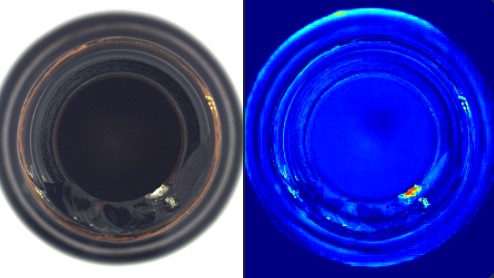

The dataset was obtained from The code uses bottle.  
https://www.mvtec.com/company/research/datasets/mvtec-ad  

1. train.py is the code that creates the model.  
2. generate_image.py is the code to generate a normal image from an abnormal image.  
3. predict.py is the code that generates the heatmap image of the anomalous area.  

The bottle dataset should be placed on the same level as the code.  

## sample image
